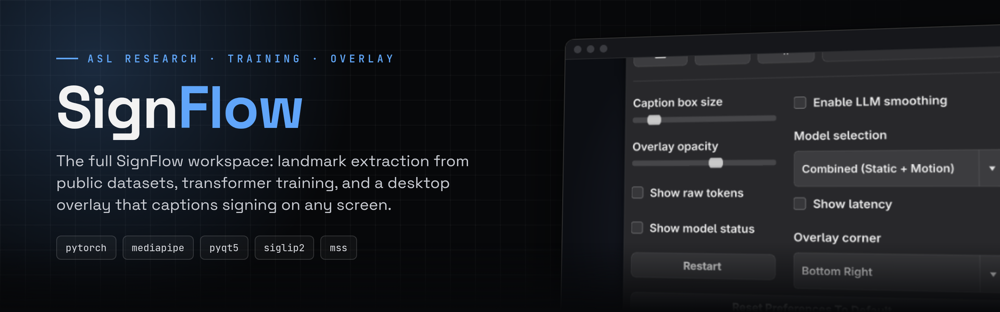
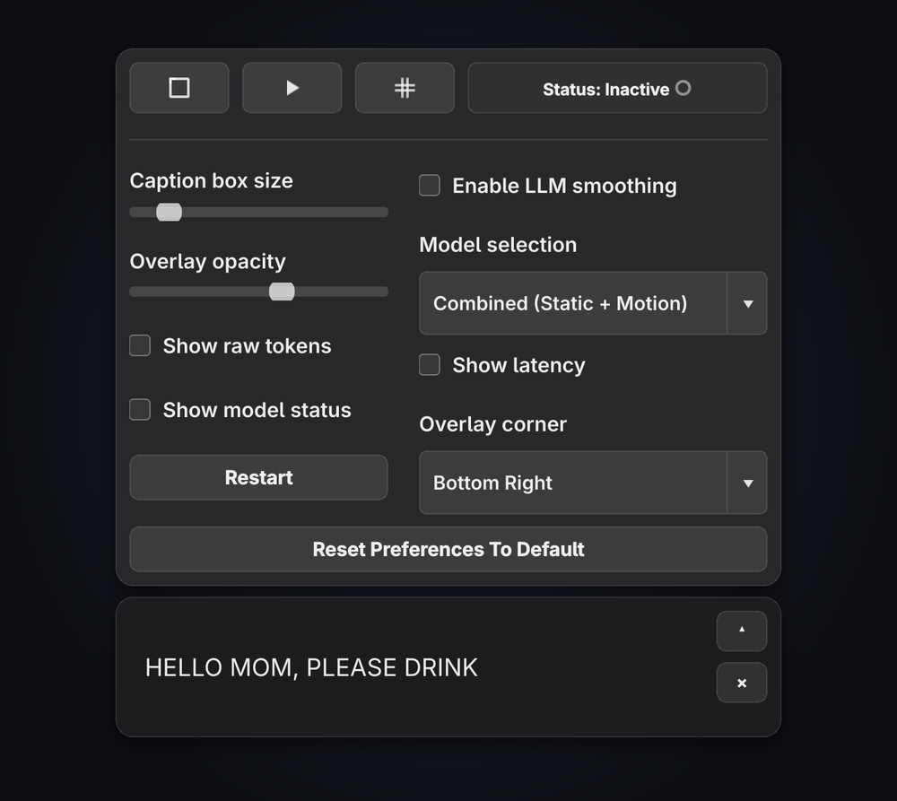
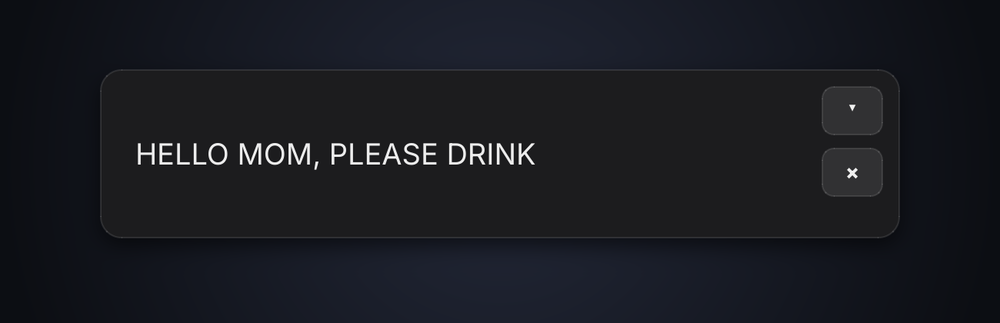
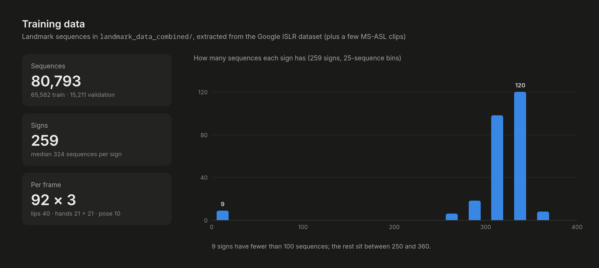

<div align="center">



<br>

[](requirements.txt)
[](train_landmark_transformer.py)
[](SignFlow-Core/)
[](#training-data)
[](.gitattributes)

**The SignFlow workspace: data extraction, model training and a desktop overlay that captions American Sign Language on any screen.**

[Screenshots](#screenshots) · [What's here](#whats-here) · [Overlay](#signflow-core--the-overlay) · [Training](#training) · [Training data](#training-data) · [Related repos](#related-repositories)

</div>

---

## Screenshots

<table>
<tr>
<td width="48%" valign="top"></td>
<td width="52%" valign="top">

<br><br>
<b>SignFlow-Core overlay.</b> An always-on-top bar that sits over a video call or stream. Pick a
screen region, and recognised signs appear as captions. The panel above it sets caption size,
opacity, model, overlay corner, and optional LLM smoothing, raw tokens and latency.
<br><br>
<sub>Rendered from the real PyQt widgets (<code>overlay_window.py</code>, <code>overlay_panels.py</code>)
with an example caption.</sub>
</td>
</tr>
</table>



## What's here

| Path | What it is |
|---|---|
| [`SignFlow-Core/`](SignFlow-Core) | The desktop overlay app (PyQt5). Screen-region capture, preview, hand tracking and live captions. See its own [readme](SignFlow-Core/readme.md). |
| [`extract_landmarks.py`](extract_landmarks.py) | Converts Kaggle ISLR parquet files to `[64, 92, 3]` NumPy sequences (vectorised), then starts video extraction. |
| [`extract_msasl_video_landmarks.py`](extract_msasl_video_landmarks.py) | Runs MediaPipe over MS-ASL / WLASL video clips to produce the same 92-landmark sequences. |
| [`train_landmark_transformer.py`](train_landmark_transformer.py) | Trains the multi-stream landmark transformer: warm-up, label smoothing, mixup, early stopping, resume and fine-tune. |
| [`train_common_words.py`](train_common_words.py) | Trains on a priority list of everyday words. |
| [`run_overnight.py`](run_overnight.py) · [`START_TRAINING.bat`](START_TRAINING.bat) | Unattended pipeline: extraction, then training until a target accuracy. |
| [`sign_inference.py`](sign_inference.py) | Webcam recognition with an OpenCV window (the cleaned-up version lives in [`signflow-`](https://github.com/nithin2719-commits/signflow-)). |
| [`landmark_data_combined/`](landmark_data_combined) | The training set: one `.npy` per sequence, `train/` and `val/` by sign. |
| [`outputs/`](outputs) | Trained checkpoints (`best_model.pth`, Git LFS) and class maps. |

## SignFlow-Core — the overlay

Two models run on every captured frame and the more confident answer wins:

| Model | Recognises | Input |
|---|---|---|
| **SigLIP2** vision model (`models/asl_alphabet_siglip/`) | the static A–Z fingerspelling alphabet (99.96 % accuracy) | hand crops |
| **3D landmark transformer** (`models/best_model.pth`) | motion signs such as *hello* and *thank you* | 92 landmarks × up to 64 frames |

```bash
cd SignFlow-Core
python -m venv .venv && .venv\Scripts\activate      # Windows (primary target)
pip install -r requirements.txt
python overlay.py
```

Open the panel (**▾**), press the crop button and drag over the video you want captioned, then
press play. Settings persist in `user_preferences.json`. The app is Windows-first. On Linux and macOS
the UI runs, but screen-capture exclusion is Windows-only.

## Training

```bash
pip install -r requirements.txt

# 1. landmarks from the Kaggle ISLR parquet files (and MS-ASL / WLASL clips)
python extract_landmarks.py
python extract_msasl_video_landmarks.py

# 2. train
python train_landmark_transformer.py --data-dir landmark_data_combined \
    --output-dir outputs/my_run --epochs 150 --batch-size 64 --units 512 --num-blocks 8
```

`--resume` continues a run and `--finetune` reloads only the weights. The default paths in these
scripts point at the original Windows workspace, so pass `--data-dir` and `--output-dir` explicitly
on other machines.

**Model:** lips, left hand, right hand and pose are embedded separately, fused with learned weights,
and passed through a stack of pre-norm transformer blocks with masked average pooling. The first
256-sign model reached 75.8 % validation accuracy. The focused 58-sign release model in
[`signflow-`](https://github.com/nithin2719-commits/signflow-) (512 units, 8 blocks, 8 heads,
26.4 M parameters) reaches 94.9 %.

## Training data

| | |
|---|---|
| Sequences | 80,793 (65,582 train · 15,211 validation) |
| Signs | 259 |
| Sources | Google Isolated Sign Language Recognition (Kaggle), plus a few MS-ASL clips |
| Shape | up to 64 frames × 92 landmarks × (x, y, z) |

Large raw folders (`landmark_data/`, `MS-ASL/`, logs) are git-ignored. Model weights are stored with
Git LFS, so run `git lfs install` before cloning to get them.

## Related repositories

| Repo | Purpose |
|---|---|
| [**signflow-**](https://github.com/nithin2719-commits/signflow-) | Clean, minimal release: the 58-sign model, webcam app and LLM sentence correction |
| [**Sign-flow-model**](https://github.com/nithin2719-commits/Sign-flow-model) | The model as a FastAPI service with a browser client |
| [**asl-modified**](https://github.com/nithin2719-commits/asl-modified) | ASL alphabet interpreter inside a two-person WebRTC video call |
